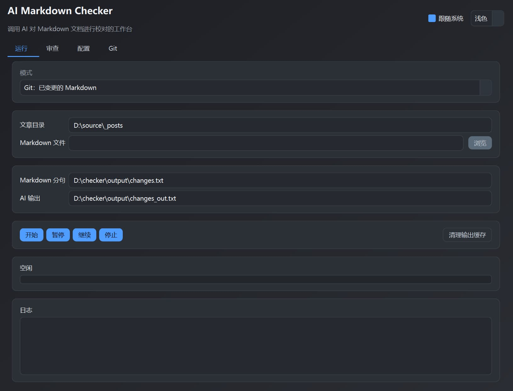
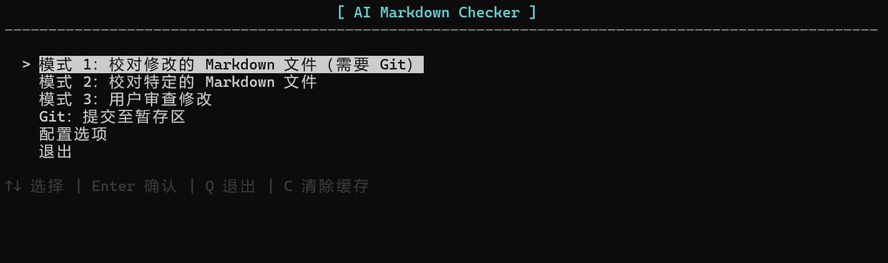

# AI Markdown Checker

这是一个专为 Markdown 文档写作者（尤其是博客作者）设计的 **AI 辅助校对工具**。

本项目是我 vibe coding 的第一次尝试，我没有写过一行代码。

它能够通过大语言模型自动通过检查您的文章，找出错别字、多字、少字和一些语法错误，并提供由用户审核的界面，确保修改的准确性。

## ✨ 主要功能

- **🕵️‍♂️ 增量校对 (Git 模式)**：利用 Git 差异对比，**只校对您刚刚修改或新增的段落**。
- **📄 单文件校对**：支持直接选择某个 Markdown 文件进行全篇校对。
- **🧠 智能解析**：基于 AST（抽象语法树）解析 Markdown，**自动忽略代码块、YAML 头信息、表格**等不需要校对的内容，只关注正文（段落、列表、引用）。
- **🔍 准确完整**：以句子为单位将文章发送给 AI，无需担心长上下文导致模型变笨，产生错误、遗漏等。
- **🛡️ 隐私安全**：使用 **Ollama** 本地运行大语言模型，无隐私泄露担忧。

注意：本项目不支持调用一般的 OpenAI API。原本本项目使用的是 `openai` 库，但我发现本地模型速度非常慢。经过测试推测是 thinking 的缘故，但我使用各种方法均无法关闭模型思考。而 Ollama Python 库直接有个参数 `think`，可以非常方便地关闭模型思考。

---

## 🛠️ 环境准备

在使用之前，请确保您的电脑上安装了以下软件：

1. **Python**：[下载 Python](https://www.python.org/downloads/)
2. **Git（可选但推荐）**：用于“增量校对”模式。 [下载 Git](https://git-scm.com/)

### 📦 安装依赖库

打开终端，进入本项目目录，运行以下命令安装所需的 Python 库：

```bash
pip install PySide6 ollama tqdm markdown-it-py
```

---

## ⚙️ 配置说明

在使用前，您需要配置 AI 模型的信息。您可以直接在 GUI 界面的“配置”标签页中修改，也可以手动编辑根目录下的 `config.json` 文件。

**config.json 示例 (使用 Ollama 本地模型):**

```json
{
  "OLLAMA_HOST": "http://localhost:11434",
  "OLLAMA_MODEL": "qwen3:8b",
  "SYSTEM_PROMPT": "请作为一名专业的文本校对员，请检查并修正以下文本中的所有错误（包括但不限于错别字、语法错误、用词不当、成分残缺等）。不要改变原文的意义，不要进行风格上的修改或重写句子，只修正错误，并保留原句的 Markdown 样式。",
  "REQUEST_DELAY_SECONDS": 0.1,
  "POSTS_DIR": "../source/_posts",
  "temperature": 1.0,
  "top_p": 1.0
}
```

**参数解释：**

- `OLLAMA_HOST`：Ollama 服务器地址。默认为 `http://localhost:11434`。
- `OLLAMA_MODEL`：模型名称（如 `qwen3:8b`、`llama3:8b` 等）。
- `SYSTEM_PROMPT`：系统提示词，用于指导 AI 如何进行校对。
- `REQUEST_DELAY_SECONDS`：两次请求之间的等待秒数（防止请求过快）。
- `POSTS_DIR`：您的 Markdown 文章所在的文件夹路径。
- `temperature`：控制模型输出的随机性和创造性。温度越低，模型越倾向于选择概率最高的词汇，输出越确定。
- `top_p`：控制模型考虑的词汇池的大小。它会从所有可能的下一个词中，选择累积概率达到 `p` 的最高概率词汇。

如果您认为 AI 对文本的改动过大，请适当降低 `temperature` 和 `top_p`。

---

## 🚀 快速上手（GUI 图形界面）

这是最简单的使用方式。

### 1. 启动软件

在项目目录下运行：

```bash
python gui.py
```



### 2. 运行校对任务

界面上有两种模式：

- **模式 1：校对修改的 Markdown (Git)**
  - 适用场景：您使用 Git 追踪文档仓库。如今修改亮起其中的文档，只想校对修改的内容。
  - 前提：您的文章目录必须是一个 Git 仓库，且有未提交的更改。
  - 点击 **“开始执行”**，软件会自动提取变更 -> 发送给 AI。

- **模式 2：校对指定 Markdown**
  - 适用场景：想检查某一篇完整的文章。
  - 选择文件，点击 **“开始执行”**。

- **清理工具**
  - 点击 **“清理输出缓存”**：删除 `output` 目录下所有生成的临时文件。

> **注意：执行过程中，软件会在 output 目录下生成中间文件（在模式 1 下为 `changes.txt` 和 `changes_out.txt`，在模式 2 下为 `filename.txt` 和 `filename_out.txt`），请等待状态变为“执行完成”。**

### 3. 人工审查

AI 处理完后，切换到 **“审查”** 标签页。

1. **加载数据**:
    - 选择 `输入清单`（`*.txt`）和 `AI 输出`（`*_out.txt`）。
2. **逐条审核**:
    - 列表会显示所有 AI 认为有问题的句子。
    - **原句**：显示原始文本。
    - **建议**：显示 AI 的修改建议。
    - **修改**：这里是最终要写入文件的内容。
3. **操作**:
    - 点击 **“采用建议”**：将 AI 的建议填入“修改”框。
    - 点击 **“应用并下一条”**：将“修改”框的内容替换到原文件中，并自动跳到下一条。
    - 点击 **“跳过”**：如果 AI 误判了，直接跳过，不做修改。
    - 点击 **“打开文件”**：用默认编辑器打开对应的 Markdown 文件进行查看。

### 4. Git 管理 (可选)

AI 处理并审查完成后，您可以切换到 **“Git”** 标签页管理您的文章仓库。

- **全部暂存**：相当于执行 `git add .`。
- **提交**：填写提交说明并点击“提交”，相当于执行 `git commit`。

---

## 💻 命令行使用（CLI）

如果您更喜欢在终端操作，提供了 checker.py 脚本：

```bash
python checker.py
```



它提供了一个交互式的文本菜单，功能与 GUI 相同：

1. 选择模式（Git 增量或单文件）。
2. 脚本自动运行 AI 处理。
3. 进入交互式审查模式，按回车跳过，输入文本则确认修改。
4. 当第一次完成全部文章的校对，请提交至 Git 暂存区。接下来可使用 Git 增量模式进行校对。

---

## 📂 项目结构说明

- gui.py：**主程序**，图形化界面。
- checker.py：**主程序**，命令行版。
- git_commit.py：Git 自动提交工具。
- checker_ai.py：负责与 AI 进行对话。
- checker_process_markdown.py：负责智能解析 Markdown，按照句对段落、列表、引用进行划分。（单文件模式使用）
- checker_add.py：负责提取 Git 仓库中的变动行。（Git 增量模式使用）
- clear_output_cache.py：清理工具，用于删除 output 文件夹下的临时文件。
- output：存放运行时生成的临时文件。
- config.json：配置文件。

---

## ❓ 常见问题 (FAQ)

**Q1：为什么我的代码块也被 AI 检查了？**

A：本工具使用了 AST 解析，正常情况下会自动忽略代码块。请确保您的 Markdown 语法标准（例如使用 ``` 包裹代码）。

**Q2：如何安装和配置 Ollama？**

A：首先安装 Ollama（[下载地址](https://ollama.com/)），然后：

1. 下载模型：`ollama pull qwen3:8b`（或其他您喜欢的模型）
2. 启动服务：`ollama serve`（通常自动启动）
3. 在 `config.json` 中配置：
   - `OLLAMA_HOST`：默认为 `http://localhost:11434`
   - `OLLAMA_MODEL`：填下载的模型名（如 `qwen3:8b`）

**Q3：Git 模式提示“没有检测到变更”？**

A：该模式通过 `git diff` 工作。请确保：

1. `POSTS_DIR` 是一个 Git 仓库（哪怕是刚运行过 `git init`）。
2. 您对文件做了修改，但**还没有 Commit**（或者有未跟踪的新文件）。

**Q4：程序运行报错 `ModuleNotFoundError：No module named 'PySide6'`?**

A：您没有安装依赖库。请运行 `pip install PySide6`。
