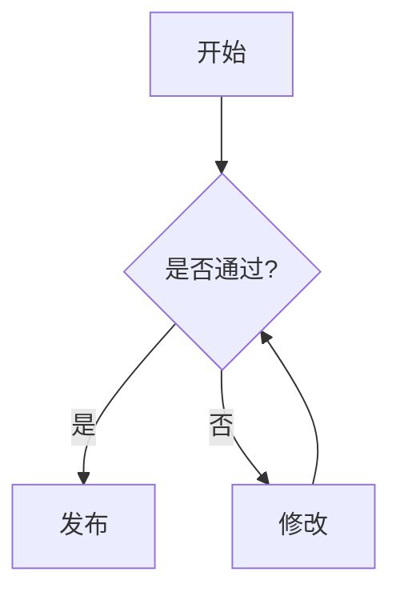

# 一级标题 H1

## 二级标题 H2

### 三级标题 H3

#### 四级标题 H4

##### 五级标题 H5

###### 六级标题 H6

---

## 1. 段落与换行

这是第一段文字。
这是同一段内的强制换行（上一行末尾有两个空格）。

这是第二段文字（段落之间空一行）。

> 引用：Markdown 用于轻量级标记。
>
> 多段引用也可以。
> 引用内同样支持换行。

---

## 2. 字体样式（强调）

- *斜体*（`*斜体*`）
- _斜体_（`_斜体_`）
- **粗体**（`**粗体**`）
- __粗体__（`__粗体__`）
- ***粗斜体***（`***粗斜体***`）
- ~~删除线~~（GFM：`~~删除线~~`）
- <u>下划线（HTML）</u>（Markdown 本身不定义下划线，常用 HTML）

---

## 3. 列表

### 3.1 无序列表

- 项目 A
- 项目 B
  - 子项目 B-1
  - 子项目 B-2
    - 三级子项目
- 项目 C

### 3.2 有序列表

1. 第一步
2. 第二步
   1. 第二步-子步骤 1
   2. 第二步-子步骤 2
3. 第三步

### 3.3 任务列表（GFM）

- [ ] 未完成任务
- [x] 已完成任务
- [ ] 支持嵌套
  - [x] 子任务已完成
  - [ ] 子任务未完成

---

## 4. 代码

### 4.1 行内代码

请在终端输入：`ping 127.0.0.1`。

### 4.2 缩进代码块（4 空格或 1 个 Tab）

    这是缩进代码块
    第二行：不会解析 *强调* 或 **粗体**

### 4.3 围栏代码块（反引号，GFM）

```text
这是 fenced code block（无语言）
包含符号：* ** ~~ ` [] () # > - 1.
```

```python
def hello(name: str) -> str:
    return f"你好，{name}！"

print(hello("世界"))
```

```json
{
  "名称": "Markdown 测试",
  "版本": 1,
  "启用": true,
  "列表": [1, 2, 3]
}
```

---

## 5. 分隔线

下面是三种常见分隔线写法（效果相同）：

---

***

___

---

## 6. 链接

### 6.1 行内链接

[中文维基百科](https://zh.wikipedia.org)

### 6.2 自动链接（GFM 常见）

- https://example.com
- <https://example.com>
- 邮箱：<test@example.com>

---

## 7. 图片

行内图片（示例链接可替换为你自己的图片地址）：


参考式图片：

![参考式图片][img1]

[img1]: https://via.placeholder.com/120.png?text=IMG "参考式图片标题"

---

## 8. 引用（嵌套）

> 外层引用
>
> > 内层引用
> >
> > - 引用中也能用列表
> > - 以及 **加粗**

---

## 9. 表格（GFM）

| 左对齐 | 居中对齐 | 右对齐 |
| :----- | :------: | -----: |
| 苹果   |   香蕉   |     10 |
| 西瓜   |   葡萄   |  12345 |
| `代码` | **粗体** | ~~删~~ |

---

## 10. 转义与特殊字符

以下字符在 Markdown 中常用于语法，需要转义时可用反斜杠：

- \* 星号
- \_ 下划线
- \# 井号
- \- 连字符
- \> 大于号
- \[ \] 方括号
- \( \) 圆括号
- \` 反引号
- \\ 反斜杠本身

示例：\*这不是斜体\*，而是普通星号。

---

## 11. 脚注（部分渲染器/扩展支持，如 GFM）

这是一段带脚注的文字。[^1] 这里还有一个脚注。[^long]

[^1]: 这是脚注 1 的内容。
[^long]: 这是一个更长的脚注，支持多行与更多说明。
    第二行缩进以保持在脚注块内。

---

## 12. 定义列表（非标准，部分渲染器支持）

术语 1
: 术语 1 的解释

术语 2
: 术语 2 的解释 A
: 术语 2 的解释 B

---

## 13. 折叠内容（HTML / GFM 常见支持）

<details>
  <summary>点击展开（summary）</summary>

这里是折叠内容内部：

- 可以写 Markdown（取决于平台）
- **加粗**、`代码`、表格等

</details>

---

## 14. 内嵌 HTML

<p>这是一个 HTML 段落（某些平台会过滤部分标签）。</p>

<div style="border: 1px solid #ddd; padding: 8px;">
  <strong>HTML 区块：</strong> 可用于更精细的排版。
</div>

---

## 15. 锚点与目录（可选，取决于平台）

有些平台会自动为标题生成锚点，你可以尝试链接到本页标题：

- [跳到“表格”章节](#9-表格gfm)

---

## 16. 数学公式（可选扩展，部分平台支持）

行内：$E = mc^2$

块级：

$$
\sum_{i=1}^{n} i = \frac{n(n+1)}{2}
$$

---

## 17. Mermaid 图（可选扩展，部分平台支持，如 GitHub）



---

## 18. 最后：混合示例

1. **标题**：混合内容
2. **说明**：在同一段中包含 `行内代码`、[链接](https://example.com)、以及 ~~删除线~~。
3. **引用**：
   > 这是一句引用
   > 以及第二行
4. **任务**：
   - [x] 覆盖常用 Markdown
   - [ ] 检查你的平台支持哪些扩展
